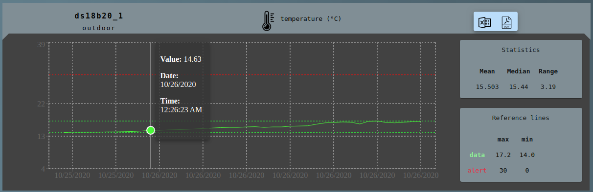
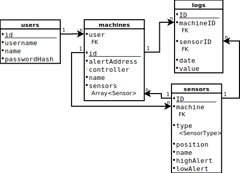

## Welcome to Logger-UI project page

    
- This project is part of a [Full Stack Open 2020 web development project](https://github.com/fullstack-hy2020/misc/blob/master/project.md).
     
- Project repositories: 
  - [Frontend](https://github.com/JuhaKarhusaari/iotDataLogger-Frontend) - React App
  - [Backend](https://github.com/JuhaKarhusaari/iotDataLogger-Backend) - Apollo server + Express.js
  - [Logs API](https://github.com/JuhaKarhusaari/serverless-logger-IoT) - [Serverless microservice](https://www.serverless.com/)
  - [Login API](https://github.com/JuhaKarhusaari/serverless-logger-login) - [Serversless microservice](https://www.serverless.com/)
  - [E2E Testing environment](https://github.com/JuhaKarhusaari/iotLogger-e2e-tests) (Cypress + docker-compose)

## Documentation
- [Käyttöliittymän käyttöohje](https://github.com/JuhaKarhusaari/JuhaKarhusaari.github.io/blob/main/docs/loggerUI-k%C3%A4ytt%C3%B6ohje%20-%2003022021.pdf)

### Deployed fullstack
Fullstack (Backend + Frontend) is deployed into Heroku platform   
- [Try deployed fullstack](https://logger-ui-heroku.herokuapp.com/)
- Serverless microservices is running on AWS
  - Login API is connected to Apollo server
  - IoT-devices sends measurement data to Logs API
  - Backend queries the measurement data directly from the database (MongoDB)

#### Using deployed app
You can try the app using a visitor account
 - Username: visitor
 - password: Welcome visitor  
  
There is running [background service](https://github.com/JuhaKarhusaari/logger-ui-modify-db) thats monitors 'visitor'-account state.  
Every 10 minutes background service generates 'mock data' to the 'visitor'-account sensors.  
And if user removes all machines and sensors, then background service adds one new machine and sensor to 'visitor'-account.  

## Database diagram
Database have 4 models & collections:  
1. Machine
2. Sensor
3. Log
4. User

Relationships between these collections is shown below in database diagram.

